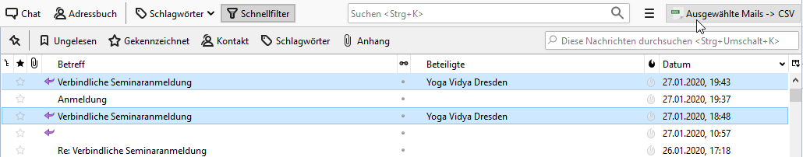
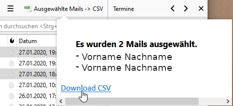
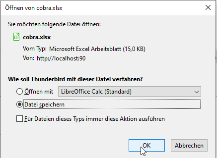
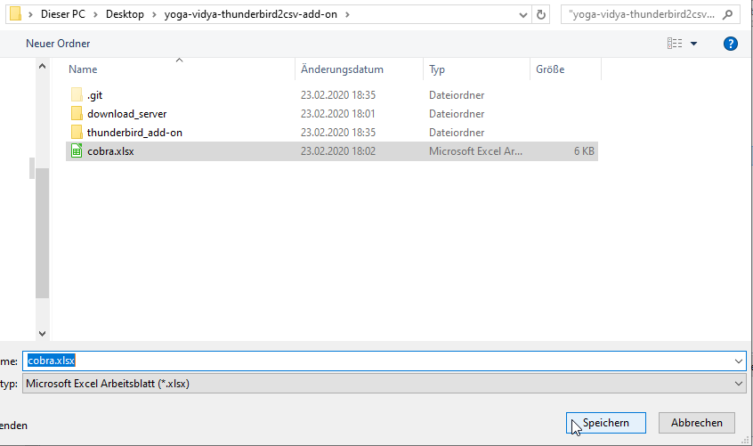
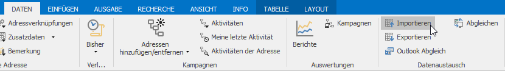
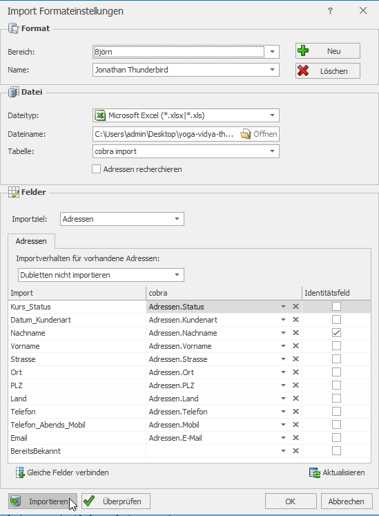
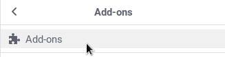
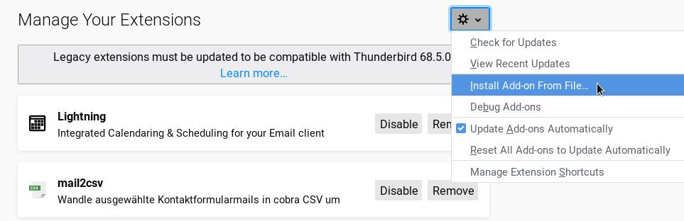
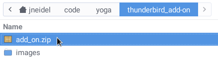
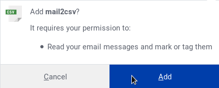

# yoga-vidya-thunderbird2csv-add-on

> Thunderbird add-on for exporting emails to cobra Adress PLUS

Thunderbird add-on + local Node server for extracting mails from Thunderbird and converting them to a cobra suitable xlsx (csv) format.

Created for [Yoga Zentrum Dresden](http://yoga-dresden.com).

## Benutzung

**Gewünschte Mails mit Strg Klick markieren**

**Auf `Download CSV` klicken**

**Datei speichern**

**Den Namen unverändert übernehmen (Cobras Format bleibt erhalten, wenn der Name
gleich bleibt)**

**In Cobra unter `Daten` auf `Importieren` klicken**

**Das ausgefüllte Format übernehmen, bzw. nachbauen**

## Update Thunderbird Add-on

Zuerst über Klicken der `setup.bat` Datei Updates installieren.

**Im Einstellungsmenu auf `Add-ons` -> `Add-ons`**

**Im Add-on Manager auf den Einstellungsbutton -> `Install Add-on from file`**

**Zum Ordner des Add-ons navigieren (sollte schon vorbereitet sein) und die
`add_on.zip` auswählen**

**Und nun bestätigen**

## Initiales Setup

**Dependencies installieren**
- [git](https://git-scm.com/downloads)
- [nodejs](https://nodejs.org/en/download)

### Setup

- Clone repo bzw. als [zip](https://github.com/jneidel/yoga-vidya-thunderbird2csv-add-on/archive/refs/heads/master.zip) downloaden
- `setup.bat` ausführen

**Thunderbird**
- Add-on Verwaltung -> Add-on aus Datei installieren
- Zip Datei wählen

**Server**
- `start.bat` -> Verknüpfung erstellen
- `win+r` `shell:startup`
- `start.bat` hier rein verschieben
- `start.bat` Rechtsklick, Ausfüren: Minimiert
